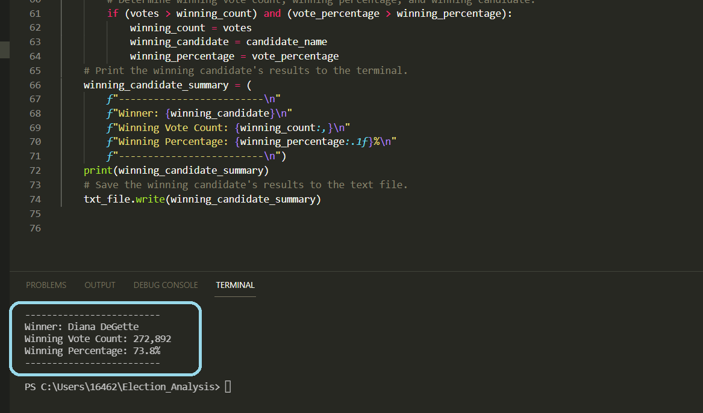

# Election_Analysis

## Project Overview
The purpose of this analysis is to audit the election results of a recent local congressional election in Colorado.
In order to perform this audit, the following were calculated: 
1. Calculate the total number of votes cast.
2. Get a complete list of candidates who received votes.
3. Calculate the total number of votes each candidate received.
4. Calculate the percentage of votes each candidate won.
5. Determine the winner of the election based on popular vote.
## Resources
Analysis was performed using Python 3.9.7 and Visual Studio Code 1.63. with the data source [election_results.csv] that was provided.
## Summary
#### The analysis of the election showed:
-There was a total of 369,711 votes casted in the election.
#### The candidates were:
   1. Charles Casper Stockham
   2. Diana DeGette 
   3. Raymon Anthony Doane
#### The final results were:
  - Charles Casper Stockham received 23.0% of the vote with 85,213 total number of votes.
  - Diana DeGette received 73.8% of the vote with 272,892 total number of votes.
  - Raymon Anthony Doane received 3.1% of the vote with 11,606 total number of votes.
###### Figure 1. Election Results presented in terminal with code

#### The winner of the election was:
  - Diana DeGette who received 73.8% of the vote with 272,892 number of votes.
###### Figure 2. Winner of the election presented in terminal with code

## Challenge Overview
The Challenge portion scnenario involved the election commission requesting the following information listed below to complete the audit:
1. The voter turnout for each county
2. The percentage of votes from each county out of the total count
3. The county with the highest turnout
## Challenge Summary
#### The voter turnout and percentage of votes from each county was:
- Jefferson: 10.5% (38,855)
- Denver: 82.8% (306,055)
- Arapahoe: 6.7% (24,801)
###### Figure 3. County voter turnout presented in terminal with code

#### The county with the highest turnout was:
-Denver!
###### Figure 4. County with highest turnout presented in terminal with code

#### Election-Audit Summary: 
The script used for this election audit can be modified in the following ways to apply towards any election for evaluation:
1. Modifying the file_to_load = os.path.join(".csv") and incorporate any data that is saved in a (.csv) file name into the (".csv") bracket to obtain results of another election.
2. The script can also be modified to other variables for analysis depending on the type of information that the data file contains, such as voter gender and voter age. The voter demographic information can further be analyzed into specific counties.

